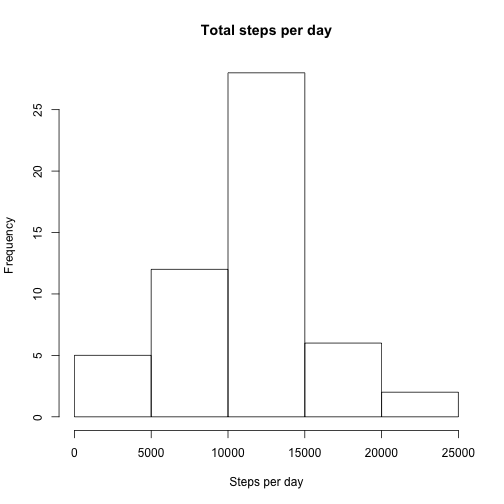
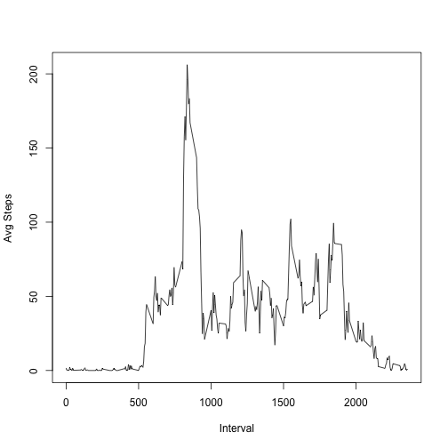
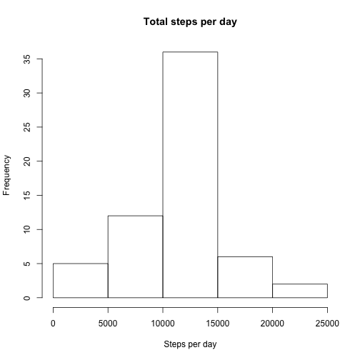
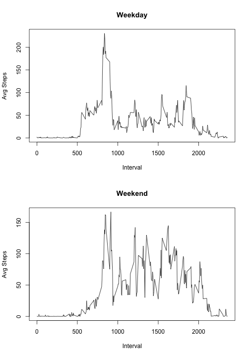

### Unzipping and loading the data. Removing the NA values


```r
unzip("activity.zip")
data <- read.csv("activity.csv")
steps_clean <- subset(data,steps != "NA")
```


### Mean and Median for total number of steps taken each day


```r
by_day <- with (steps_clean, aggregate(steps, by = list(date), sum))
hist(by_day[,2], main  = "Total steps per day", xlab="Steps per day")
```

 

```r
mn <- mean(by_day[,2])
md <- median(by_day[,2])
cat("Mean is: ", mn, " and Median is: ",md)
```

```
## Mean is:  10766.19  and Median is:  10765
```


### Histogram with steps aggregated over interval


```r
plot1 <- with (steps_clean, aggregate(steps, by = list(interval), mean))
plot (plot1, type="l", xlab = "Interval", ylab = "Avg Steps")
```

 

```r
max_int <- plot1[which.max(plot1[,2]),1]
cat("Interval having maximum average steps is", max_int)
```

```
## Interval having maximum average steps is 835
```

### Imputing average values of intervals to NA values
The mean remains the same, but median changes to the value of mean.


```r
na_sum <- sum(is.na(data$steps))
cat("Total NA Values: ", na_sum)
```

```
## Total NA Values:  2304
```

```r
clean_data <- data
for (i in 1:nrow(clean_data)) {
        if (is.na(clean_data$steps[i])) {
           clean_data$steps[i] <- plot1[which(plot1[,1] == clean_data$interval[i]),2]
        }
                
                
        }

by_day_clean <- with (clean_data, aggregate(steps, by = list(date), sum))
hist(by_day_clean[,2], main  = "Total steps per day", xlab="Steps per day")
```

 

```r
mn1 <- mean(by_day_clean[,2])
md1 <- median(by_day_clean[,2])
cat("Mean is: ", mn1, " and Median is: ",md1)
```

```
## Mean is:  10766.19  and Median is:  10766.19
```


### Plotting Weekday and Weekend data
We observe higher number of acitivity during weekends


```r
clean_data$wday <- weekdays(as.POSIXct(clean_data$date))
weekend_data <- subset(clean_data, clean_data$wday %in% c("Saturday", "Sunday"))
weekday_data <- subset(clean_data, !(clean_data$wday %in% c("Saturday", "Sunday")))

plot_weekday <- with (weekday_data, aggregate(steps, by = list(interval), mean))
plot_weekend <- with (weekend_data, aggregate(steps, by = list(interval), mean))
par(mfrow=c(2,1))
plot (plot_weekday, type="l", main = "Weekday", xlab = "Interval", ylab = "Avg Steps")
plot (plot_weekend, type="l", main = "Weekend", xlab = "Interval", ylab = "Avg Steps")
```

 
